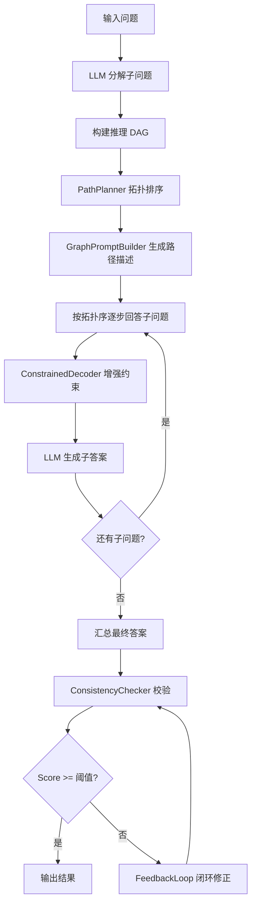

## 用户需求

用户提出三个核心问题，需要全面诊断和修复：

### 1. 数据集问题（严重）

- **GSM8K**: 仅取 500 条子集（原始测试集 ~1319 条），非全量测试
- **HotpotQA**: 仅取 500 条子集（原始测试集 ~7405 条），非全量测试
- **CLUTRR**: 灾难性问题——500 条样本实际只有 **5 条硬编码样例**循环复制（`data/prepare_data.py` 的 `_clutrr_builtin_samples` 函数，`base` 列表 5 条，通过 `i % len(base)` 循环填充），HuggingFace 下载失败后 fallback 到这些样例。CLUTRR 实验结果完全不具备统计意义，需要从真正的 CLUTRR 数据源下载真实数据。

### 2. 方法实现不完整（关键）

论文 project-plan.md 描述的三大模块架构，实际有多处核心模块未接线：

- **`ConstrainedDecoder`（约束解码器）**：模块2核心组件，完全未导入未使用
- **`GraphPromptBuilder`（图→Prompt转换器）**：模块2核心组件，完全未导入未使用
- **`FeedbackLoop`（闭环修正）**：模块3核心创新点，完全未导入未使用
- **`DynamicGraphBuilder` + `EntityRelationExtractor`**：模块1核心组件，被导入但被绕过，实际用 `_decompose` + `_build_graph` 内联简化版替代
- **NLI 语义校验默认关闭**（`enable_nli=False`），`semantic_score` 硬编码为 0.5，论文声称"三层校验"实际只有两层
- **Consistency Score 无区分度**：所有 GERS 实验都是 0.80（α=0.6×~1.0 + β=0.4×0.5=0.8），不反映真实推理质量

### 3. 实验不完整

- **ToT 基线**：有完整实现但从未运行实验
- **CoT-SC**：GSM8K 仅 100 条，HotpotQA 仅 71 条，远少于其他方法 500 条
- **消融实验**：仅 20 条样本，且缺少 `wo_constraint` 和 `wo_feedback` 配置（因对应模块未接入无法做）
- **评估指标缺失**：Graph Coverage、Token Efficiency、Logical Coherence 均未在实验中记录

## 产品概述

修复 GERS 系统的方法实现缺陷，确保论文描述的三大模块完整接入运行；替换 CLUTRR 为真实数据集；补全所有基线和消融实验；使 Consistency Score 具有实际区分度。

## 核心功能

- 接入被绕过的核心模块（ConstrainedDecoder、GraphPromptBuilder、FeedbackLoop、DynamicGraphBuilder）
- 启用 NLI 语义校验或提供有效的语义层评分替代方案
- 从真实数据源下载 CLUTRR 数据集替换硬编码样例
- 补全 ToT 基线实验和 CoT-SC 全量实验
- 扩充消融实验至 5 种配置 + 更大样本量
- 补充缺失的评估指标采集

## 技术栈

- Python 3.x（现有项目）
- LLM API: 阿里云 DashScope (qwen3-8b)，OpenAI 兼容接口
- 图算法: NetworkX（拓扑排序、环路检测、最大流覆盖度）
- NLI 模型: HuggingFace `cross-encoder/nli-deberta-v3-large`（延迟加载，已有实现）
- 数据集: HuggingFace datasets / 本地 JSON
- 测试框架: pytest

## 实现方案

### 1. 核心模块接线修复

**问题**：`generation_pipeline.py` 导入了 `DynamicGraphBuilder` 和 `EntityRelationExtractor` 但不使用，`ConstrainedDecoder`、`GraphPromptBuilder`、`FeedbackLoop` 完全未导入。实际用的是三个硬编码 Prompt（`DECOMPOSE_PROMPT`/`ANSWER_SUBQ_PROMPT`/`FINAL_ANSWER_PROMPT`）替代了模块2的全部功能。

**修复策略**：保留当前 `_decompose` + 按拓扑序逐步执行的架构（这是重构后的正确做法），但将缺失模块作为增强层接入：

- **GraphPromptBuilder**：在 `_decompose` 后、逐步回答子问题前，用 `GraphPromptBuilder` 生成结构化推理路径描述，注入到每个子问题的 Prompt 上下文中（而非替代当前流程）
- **ConstrainedDecoder**：在子问题回答阶段，用 `ConstrainedDecoder.apply_constraint()` 增强每个子问题的 Prompt，强制要求引用前驱步骤
- **FeedbackLoop**：在 `reason()` 方法的一致性校验步骤后，当 `score < consistency_threshold` 时，调用 `FeedbackLoop.refine()` 触发回溯修正，实现真正的闭环
- **DynamicGraphBuilder + EntityRelationExtractor**：当前 `_decompose`+`_build_graph` 的内联实现已经更可靠（直接用 LLM 分解子问题构建 DAG），保留为主路径。但可以在 FeedbackLoop 修正时使用 `DynamicGraphBuilder.update()` 增量更新图

### 2. Consistency Score 区分度修复

**问题**：NLI 关闭导致 semantic_score 恒为 0.5，结构层对于简单线性链恒为 ~1.0，综合恒为 0.8。

**修复策略**：

- **方案A（推荐）**：启用 NLI 但使用轻量级方案——用 LLM 自身做 NLI 判断（而非加载独立 NLI 模型），即用 Prompt 让 LLM 判断前驱节点与后继节点之间是否存在蕴含关系，返回 0-1 分数。这样不增加额外模型依赖
- **方案B**：加载 HuggingFace NLI 模型（`nli_verifier.py` 已有实现），但需要下载模型文件（~400MB）
- **结构层增强**：当前覆盖度计算对线性链总是 1.0，增加子答案置信度因子——用子答案长度、是否包含"不确定/I don't know"等信号降低覆盖度

### 3. CLUTRR 数据集修复

**问题**：`data/prepare_data.py` 中 `_clutrr_builtin_samples()` 只有 5 条硬编码样例，HuggingFace `load_dataset("CLUTRR/v1")` 下载失败后 fallback 到这些样例，500 条实际只有 5 个不同问题。

**修复策略**：

- 尝试多个 CLUTRR 数据源：`CLUTRR/v1`、`clutrr`、GitHub 原始仓库 `@_facebookresearch/CLUTRR`
- 如果 HuggingFace 持续不可用，从 GitHub 直接下载 CLUTRR 的 `data_gen/templates/` 生成的样本
- 构建至少 200 条不同家庭关系链的真实 CLUTRR 样本
- 修复 CLUTRR 的评估——答案标准化需要支持英文关系词到中文的映射（或直接使用英文标签）

### 4. 实验补全

- **ToT 基线**：在 GSM8K 和 HotpotQA 上各跑 200 条（ToT 耗时极长，每条需多次 LLM 调用）
- **CoT-SC**：补到与主实验相同的样本量（GSM8K 500 条、HotpotQA 500 条），N=3 采样
- **消融实验**：扩充到 5 种配置（Full GERS / w/o ConstrainedDecoder / w/o ConsistencyCheck / w/o FeedbackLoop / w/o Context传递），样本量提升到 100 条
- **评估指标**：在 `run_quick_exp.py` 中增加 Token 计数和 Graph Coverage 记录

## 实现注意事项

- **性能**：FeedbackLoop 接入后每条 GERS 样本可能多 1-3 次 LLM 调用（修正迭代），需设 `max_iterations=2` 控制开销；ToT 每条需 ~20+ 次 LLM 调用，200 条预计 2-3 小时
- **日志**：模块接线后需在日志中打印各阶段状态（分解/构图/执行/校验/修正），便于调试
- **向后兼容**：保留 `_no_context` 等消融参数，新增 `_no_constraint`/`_no_feedback` 参数控制消融
- **爆炸半径**：修改 `generation_pipeline.py` 核心流程后，已有实验结果需要重跑验证一致性

## 架构设计

修复后的完整推理流程：



## 目录结构

```
d:\code\GOT\
├── src/
│   ├── chain_generation/
│   │   └── generation_pipeline.py        # [MODIFY] 接入 ConstrainedDecoder、GraphPromptBuilder、FeedbackLoop；启用闭环修正
│   ├── consistency_check/
│   │   ├── consistency_score.py          # [MODIFY] 启用 NLI 或 LLM-based 语义校验，增强结构层区分度
│   │   └── nli_verifier.py               # [MODIFY] 增加 LLM-based NLI fallback 方案（不依赖 HuggingFace 模型下载）
│   └── utils/
│       └── metrics.py                    # [MODIFY] 增加 Token 计数和 Graph Coverage 指标采集
├── data/
│   └── prepare_data.py                   # [MODIFY] 修复 CLUTRR 数据源，移除 5 条循环复制逻辑，接入真实 CLUTRR 数据
├── experiments/
│   ├── run_quick_exp.py                  # [MODIFY] 增加 Token/Graph Coverage 指标记录，支持 ToT 方法
│   └── run_ablation_v2.py                # [MODIFY] 扩充到 5 种消融配置，样本量提升到 100 条
├── docs/
│   └── experiment_records.md             # [MODIFY] 更新为修复后的完整实验记录
└── tests/
    └── test_chain_generation.py          # [MODIFY] 更新测试以覆盖接入后的完整流程
```

## 关键代码结构

修复后的 `generation_pipeline.py` 核心流程签名变更：

```python
class GraphGuidedGenerator:
    def __init__(self,
                 model=None,
                 constraint_mode: str = "soft",
                 max_iterations: int = 2,           # 修复：从1改为2，允许1次修正
                 consistency_threshold: float = 0.6,
                 enable_nli: bool = True,            # 修复：默认启用
                 _no_context: bool = False,
                 _no_constraint: bool = False,       # 新增：消融-无约束解码
                 _no_feedback: bool = False):        # 新增：消融-无闭环修正

    def reason(self, question: str, context: str = "") -> Dict:
        # ① 分解 → ② 构图 → ③ 拓扑排序
        # ④ GraphPromptBuilder 生成路径描述（新增）
        # ⑤ 按拓扑序逐步回答（ConstrainedDecoder 增强约束）（增强）
        # ⑥ 汇总最终答案
        # ⑦ ConsistencyChecker 校验
        # ⑧ if score < threshold and not _no_feedback: FeedbackLoop.refine()（新增）
        # ⑨ 返回结果（含 iterations > 0 时表示触发了修正）
```

## Agent Extensions

### SubAgent

- **code-explorer**
- Purpose: 在修改 `generation_pipeline.py` 前，用 code-explorer 全面扫描所有调用 `GraphGuidedGenerator` 的地方（`run_quick_exp.py`、`run_ablation_v2.py`、`run_comparison.py`、测试文件），确保接口变更不遗漏调用点
- Expected outcome: 产出完整的调用点清单，确保接口变更后所有调用方同步更新